 

## Processo:

🔌 Funcionalidades Implementadas:

<ul>
    <li><a href="#">Link 1</a></li>
    <li><a href="#">Link 2</a></li>
    <li><a href="#">Link 3</a></li>
    <li><a href="#">Link 4</a></li>
    <li><a href="#">Link 5</a></li>   
</ul>

🖇️Links Úteis:

<ul>
    <li><a href="#">Link 1</a></li>
    <li><a href="#">Link 2</a></li>
    <li><a href="#">Link 3</a></li>
    <li><a href="#">Link 4</a></li>
    <li><a href="#">Link 5</a></li>   
</ul>

📦 Entregas:

<ul>
    

Entrega 1

<ul>
    <li><a href="#">Link 1</a></li>
    <li><a href="#">Link 2</a></li>
    <li><a href="#">Link 3</a></li>
    <li><a href="#">Link 4</a></li>
    <li><a href="#">Link 5</a></li>   
</ul>

Entrega 2

<ul>
    <li><a href="#">Link 1</a></li>
    <li><a href="#">Link 2</a></li>
    <li><a href="#">Link 3</a></li>
    <li><a href="#">Link 4</a></li>
    <li><a href="#">Link 5</a></li>   
</ul>

 
</ul>

---

## Front-end:

## Back-end: 

---

## 🧜 UML com o Mermaid:

```mermaid

classDiagram

class Postagem {
  <<Entity>>
  - id: Long
  - autor: String
  - tag: TipoPostagem
  - titulo: String
  - paragrafo: String
  - imagemOuVideo: String
  - link: String
  - fixado: boolean
  + LIMITE_PALAVRAS: int = 300
}

class Comentario {
  <<Entity>>
  - id: Long
  - titulo: String
  - conteudo: String
  - dataCriacao: LocalDateTime
  - autor: String
}

class PostagemService {
  <<Service>>
  + findAll(): List<Postagem>
  + listarPostagensPorTag(tag: TipoPostagem): List<Postagem>
  + listarPostagensFixadas(): List<Postagem>
  + buscarPorId(id: Long): Postagem
  + criarPostagem(postagem: Postagem): Postagem
  + editarPostagem(id: Long, novaPostagem: Postagem): void
  + deletarPostagem(id: Long): void
  - validarLimitePalavras(texto: String): void
  + fixarPostagem(id: Long): void
  + desfixarPostagem(id: Long): void
}

class PostagemRepository {
  <<Repository>>
  + findAllByTag(tag: TipoPostagem): List<Postagem>
  + findAllByFixadoTrue(): List<Postagem>
  + save(postagem: Postagem): Postagem
  + findById(id: Long): Optional<Postagem>
  + atualizarPostagem(id: Long, novaPostagem: Postagem): void
  + deleteById(id: Long): void
  + atualizarFixado(id: Long, fixado: boolean): void
}

class ComentarioRepository {
  <<Repository>>
  + findByPostagemIdOrderByDataCriacaoDesc(postagemId: Long): List<Comentario>
  + findById(id: Long): Optional<Comentario>
  + save(comentario: Comentario): Comentario
  + deleteById(id: Long): void
}

class ComentarioService {
  <<Service>>
  + listarPorPostagem(postagemId: Long): List<Comentario>
  + criarComentario(postagemId: Long, comentario: Comentario, autor: User): Comentario
  + editarComentario(id: Long, novoComentario: Comentario, user: User): Comentario
  + deletarComentario(id: Long, user: User): void
}

class PostagemController {
  <<RestController>>
  + listarTodasPostagens(): ResponseEntity<List<Postagem>>
  + listarPostagensPorTag(tag: TipoPostagem): ResponseEntity<List<Postagem>>
  + listarPostagensFixadas(): ResponseEntity<List<Postagem>>
  + criarPostagem(postagem: Postagem): ResponseEntity<Postagem>
  + buscarPorId(id: Long): ResponseEntity<Postagem>
  + editarPostagem(id: Long, novaPostagem: Postagem): ResponseEntity<Void>
  + deletarPostagem(id: Long): ResponseEntity<Void>
  + fixarPostagem(id: Long): ResponseEntity<Postagem>
  + desfixarPostagem(id: Long): ResponseEntity<Postagem>
}

class ComentarioController {
  <<RestController>>
  + listarComentarios(postagemId: Long): ResponseEntity<List<Comentario>>
  + criarComentario(postagemId: Long, comentario: Comentario, user: User): ResponseEntity<Comentario>
  + editarComentario(id: Long, novoComentario: Comentario, user: User): ResponseEntity<Comentario>
  + deletarComentario(id: Long, user: MyUser): ResponseEntity<Void>
}

class User {
  <<Entity>>
  - id: Long
  - email: String
  - password: String
  - userName: String
  - midleName: String
  - biografia: String
  - localizacao: String
  - idade: int
  - photo: String
  - LinkInstagram: String
  - LinkLinkedin: String
  - LinkLattes: String
  - LinkWhatsapp: String
  + LIMITE_BIO: int = 300
}

class UserRepository {
  <<Repository>>
  + findById(id: Long): Optional<User>
  + findByEmail(email: String): Optional<User>
  + save(user: User): User
  + delete(user: User): User
}

class UserService {
  <<Service>>
  + getUserById(id: Long): User
  + getUserByEmail(email: String): User
  + createUser(user: User): User
  + updateProfile(id: Long, updatedUser: User): User
  + deleteUser(id: Long): void
  + validateAndSetTemas(user: User, temas: List<TemaAtuacao>): void
}

class UserController {
  <<RestController>>
  + getProfile(id: Long): ResponseEntity<User>
  + createUser(user: User): ResponseEntity<User>
  + updateProfile(id: Long, updatedUser: User): ResponseEntity<User>
  + deleteUser(id: Long): ResponseEntity<Void>
  + updateTemas(id: Long, temas: List<TemaAtuacao>): ResponseEntity<User>
}

class TipoPostagem {
  <<enum>>
  - NENHUM: int = 0
  - ARTIGO: int = 1
  - NOVIDADE: int = 2
  - NOTICIA: int = 3
  - EVENTO: int = 4
  - DICA: int = 5
}

class Profissao {
  <<enum>>
  - ESTAGIARIO: int = 0
  - SENIOR: int = 1
  - PLENIOR: int = 2
  - JUNIOR: int = 3
  - AGRICULTOR: int = N
}

class Genero {
  <<enum>>
  - MASCULINO: int = 0
  - FEMININO: int = 1
  - NAO_BINARIO: int = 2
  - OUTRO: int = 3
  - PREFIRO_NAO_DIZER: int = 4
}

class Role {
  <<enum>>
  - USER: int = 0
  - ADMIN: int = 1
}

class TemaAtuacao {
  <<enum>>
  - DESENVOLVIMENTO_SOFTWARE: int = 0
  - INTELIGENCIA_ARTIFICIAL: int = 1
  - DESIGN: int = 2
  - MARKETING: int = 3
  - SEGURANCA: int = 4
  - GESTAO_DE_PROJETOS: int = N
}

Postagem "1" -- "0..*" Comentario : postagem
Comentario "1" -- "1" Postagem : comentarios
User "1" -- "0..*" Postagem : postagens
User "1" -- "0..*" Comentario : comentarios
User "1" -- "1" Role : role
User "1" -- "1" Genero : genero
Postagem "1" -- "1" TipoPostagem : tipoPostagem
User "0..1" -- "0..*" Profissao : profissao
User "0..*" -- "0..*" TemaAtuacao : temasDeAtuacao
```

---

### 👨‍💻 Contribuidores:

